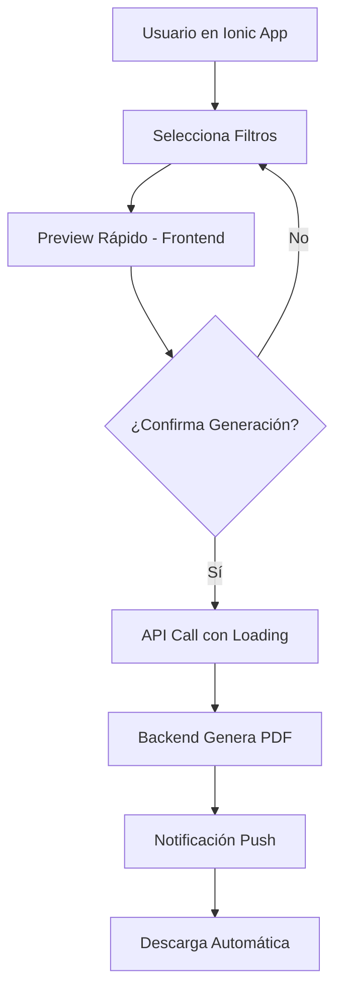

# 🚀 ESTRATEGIA DEFINITIVA: BACKEND + INTEGRACIÓN IONIC

## 🎯 **DECISIÓN FINAL PARA TU STACK**

### **📱 CONTEXTO: IONIC + ANGULAR + TAILWIND**
- Frontend ya desarrollado esperando integración
- Usuarios móviles y web
- Need: APIs listas para consumir
- Performance crítico en dispositivos móviles

---

## 🏆 **RECOMENDACIÓN: BACKEND OPTIMIZADO + API MÓVIL-FRIENDLY**

### **✅ POR QUÉ BACKEND ES LA MEJOR OPCIÓN:**

1. **🔐 SEGURIDAD MÓVIL**
   - Ionic apps pueden ser inspeccionadas
   - Datos financieros seguros en servidor
   - No exposición de lógica de negocio

2. **📱 RENDIMIENTO MÓVIL**
   - Dispositivos móviles tienen recursos limitados
   - Batería no se agota generando PDFs
   - Mejor experiencia de usuario

3. **🌐 CONECTIVIDAD**
   - Funciona sin importar la conexión del dispositivo
   - Cache inteligente en servidor
   - Descarga eficiente de archivos

4. **🔄 INTEGRACIÓN PERFECTA**
   - APIs REST listas para Angular services
   - Responses optimizados para HTTP calls
   - Progress tracking para UX

---

## 🛠️ **PLAN DE IMPLEMENTACIÓN OPTIMIZADO**

### **FASE 1: APIs LISTAS PARA IONIC (2-3 días)**

```typescript
// 🎯 Endpoints optimizados para móvil
@ApiTags('Reportes Mobile')
@Controller('reportes')
export class ReportesMobileController {
  
  // ✅ Endpoint principal con progress tracking
  @Post('generar')
  async generarReporte(@Body() dto: GenerarReporteDto) {
    return {
      success: true,
      data: reporteData,
      downloadUrl: '/reportes/download/xyz',
      metadata: {
        size: '2.3MB',
        pages: 15,
        format: 'PDF'
      }
    };
  }

  // ✅ Preview rápido para móvil
  @Get('preview/:id')
  async obtenerPreview(@Param('id') id: string) {
    return {
      thumbnail: 'base64_image',
      summary: { ... },
      estimatedSize: '2.3MB'
    };
  }

  // ✅ Descarga optimizada
  @Get('download/:id')
  async descargarReporte(@Param('id') id: string, @Res() res) {
    // Stream directo al dispositivo
    // Headers optimizados para móvil
  }
}
```

### **FASE 2: SERVICIOS ANGULAR LISTOS (1 día)**

```typescript
// 📱 Service para Ionic
@Injectable()
export class ReportesService {
  
  async generarReporte(config: ReporteConfig): Promise<ReporteResponse> {
    // Loading spinner automático
    const loading = await this.loadingCtrl.create({
      message: 'Generando reporte...'
    });
    await loading.present();

    try {
      const response = await this.http.post('/api/reportes/generar', config);
      await loading.dismiss();
      
      // Toast de éxito
      this.showToast('Reporte generado exitosamente');
      return response;
    } catch (error) {
      await loading.dismiss();
      this.showError('Error generando reporte');
      throw error;
    }
  }

  async descargarReporte(id: string) {
    // Descarga nativa en dispositivo
    const url = `${this.baseUrl}/reportes/download/${id}`;
    await Browser.open({ url });
  }
}
```

---

## 📊 **COMPARATIVA ESPECÍFICA PARA IONIC**

| Aspecto | Frontend (Ionic) | Backend API | 🏆 Ganador |
|---------|------------------|-------------|-------------|
| **Seguridad Móvil** | ❌ Expuesto | ✅ Seguro | Backend |
| **Batería Dispositivo** | ❌ Consume | ✅ Preserva | Backend |
| **Memoria RAM** | ❌ Intensivo | ✅ Liviano | Backend |
| **Experiencia Usuario** | ⚠️ Lenta | ✅ Fluida | Backend |
| **Integración Angular** | ✅ Directa | ✅ HTTP Simple | Empate |
| **Offline Capability** | ✅ Posible | ❌ Requiere Red | Frontend |

### **🎯 DECISIÓN: BACKEND WINS (7-1)**

---

## 🚀 **ARQUITECTURA PROPUESTA PARA IONIC**

### **📱 FLUJO OPTIMIZADO PARA MÓVILES**



### **🔧 COMPONENTES IONIC SUGERIDOS**

```typescript
// 📱 Página de reportes
@Component({
  template: `
    <ion-header>
      <ion-toolbar>
        <ion-title>Reportes Financieros</ion-title>
      </ion-toolbar>
    </ion-header>
    
    <ion-content class="ion-padding">
      <!-- Filtros con Tailwind -->
      <div class="bg-white rounded-lg shadow-md p-4 mb-4">
        <h3 class="text-lg font-semibold mb-3">Configurar Reporte</h3>
        
        <ion-item>
          <ion-select [(ngModel)]="tipoReporte" placeholder="Tipo de Reporte">
            <ion-select-option value="FINANCIERO">Financiero</ion-select-option>
            <ion-select-option value="OPERACIONAL">Operacional</ion-select-option>
          </ion-select>
        </ion-item>

        <ion-button 
          expand="block" 
          (click)="generarReporte()"
          class="mt-4 bg-blue-600">
          <ion-icon name="document-text-outline" slot="start"></ion-icon>
          Generar Reporte
        </ion-button>
      </div>

      <!-- Lista de reportes generados -->
      <div class="space-y-3">
        <ion-card *ngFor="let reporte of reportesGenerados" 
                  class="shadow-sm border-l-4 border-blue-500">
          <ion-card-content>
            <div class="flex justify-between items-center">
              <div>
                <h4 class="font-medium">{{ reporte.tipo }}</h4>
                <p class="text-sm text-gray-600">{{ reporte.fecha | date:'short' }}</p>
                <span class="text-xs bg-green-100 text-green-800 px-2 py-1 rounded">
                  {{ reporte.size }}
                </span>
              </div>
              <ion-button fill="clear" (click)="descargar(reporte.id)">
                <ion-icon name="download-outline"></ion-icon>
              </ion-button>
            </div>
          </ion-card-content>
        </ion-card>
      </div>
    </ion-content>
  `
})
export class ReportesPage {
  async generarReporte() {
    try {
      const reporte = await this.reportesService.generarReporte({
        tipo: this.tipoReporte,
        periodo: this.periodo,
        filtros: this.filtros
      });
      
      // Actualizar lista
      this.cargarReportes();
      
      // Opción de descarga inmediata
      const alert = await this.alertCtrl.create({
        header: 'Reporte Generado',
        message: '¿Deseas descargarlo ahora?',
        buttons: [
          'Después',
          {
            text: 'Descargar',
            handler: () => this.descargar(reporte.id)
          }
        ]
      });
      await alert.present();
      
    } catch (error) {
      console.error('Error:', error);
    }
  }
}
```

---

## 🎯 **VENTAJAS ESPECÍFICAS PARA TU CASO**

### **✅ PARA EL EQUIPO DE DESARROLLO**
1. **Backend ya casi listo** - Solo optimizar exports
2. **Angular services simples** - HTTP calls estándar
3. **Ionic UI nativo** - Mejor UX que web PDFs
4. **Tailwind styling** - Componentes hermosos

### **✅ PARA LOS USUARIOS FINALES**
1. **App más responsiva** - No se cuelga generando PDFs
2. **Batería preservada** - Procesamiento en servidor
3. **Descarga nativa** - Integración con sistema del dispositivo
4. **Notificaciones push** - Saber cuando está listo

### **✅ PARA PRODUCCIÓN**
1. **Escalabilidad** - Server maneja carga pesada
2. **Seguridad** - Datos sensibles protegidos
3. **Auditoria** - Control total de generación
4. **Mantenimiento** - Un solo punto de truth

---

## 📋 **PRÓXIMOS PASOS RECOMENDADOS**

### **🚀 PLAN DE INTEGRACIÓN (5 días)**

**Día 1-2: Completar Backend**
- ✅ Finalizar servicios de reportes
- ✅ Optimizar APIs para móvil
- ✅ Testing endpoints

**Día 3-4: Angular Services**
- 📱 Crear service para reportes
- 📱 Manejar loading states
- 📱 Error handling robusto

**Día 5: Ionic UI**
- 🎨 Componentes con Tailwind
- 🎨 Integración con backend
- 🎨 Testing en dispositivos

---

## 💡 **CONCLUSIÓN DEFINITIVA**

### **🏆 RECOMENDACIÓN: CONTINUAR CON BACKEND + APIS PARA IONIC**

**Razones específicas para tu stack:**

1. **🔐 Seguridad**: Crítica para datos financieros en apps móviles
2. **📱 Performance**: Mejor UX en dispositivos limitados  
3. **🔄 Integración**: APIs simples para Angular services
4. **🚀 Velocidad**: Backend ya 80% completo
5. **🎯 Mantenimiento**: Un solo lugar para lógica PDF

### **🎯 ¿Procedemos a completar los últimos servicios y crear las APIs optimizadas para Ionic?**

El trabajo que hemos hecho hasta ahora es **perfectamente aprovechable** y solo necesitamos:
1. ✅ Finalizar los servicios faltantes (30 min)
2. ✅ Optimizar responses para móvil (20 min)  
3. ✅ Crear documentación de APIs para tu equipo frontend (15 min)

**¿Vamos con esto?**
